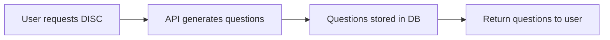
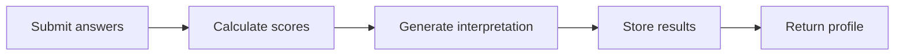

# 📊 DISC Personality Assessment - Complete Guide

## Table of Contents
- [DISC Theory Overview](#disc-theory-overview)
- [DISC vs Big Five](#disc-vs-big-five)
- [Assessment Flow](#assessment-flow)
- [API Endpoints](#api-endpoints)
- [Score Interpretation](#score-interpretation)
- [Swedish Translations](#swedish-translations)
- [Example Profiles](#example-profiles)
- [Implementation Details](#implementation-details)

---

## DISC Theory Overview

### What is DISC?

DISC is a behavioral assessment tool that categorizes observable behavior into four primary personality traits:

- **D** - Dominance
- **I** - Influence
- **S** - Steadiness
- **C** - Conscientiousness

### Historical Background

DISC was developed by psychologist William Moulton Marston in the 1920s. Unlike Big Five (which measures traits), DISC measures **behavioral tendencies** - how people typically act in different situations.

### The Four DISC Dimensions

#### 🔴 Dominance (D)
**Swedish:** Dominans / Drivkraft

**Core Characteristics:**
- Results-oriented and direct
- Competitive and decisive
- Confident and assertive
- Challenges the status quo
- Values: Winning, success, competition

**Behavioral Indicators:**
- Takes charge in group situations
- Makes quick decisions
- Focuses on the bottom line
- Direct communication style
- Comfortable with confrontation

**Strengths:**
- Gets things done
- Makes tough decisions
- Drives change
- Problem-solver
- Goal-oriented

**Challenges:**
- May be perceived as aggressive
- Can overlook details
- May not consider others' feelings
- Impatient with slow pace

---

#### 🟡 Influence (I)
**Swedish:** Inflytande / Påverkan

**Core Characteristics:**
- Outgoing and enthusiastic
- Optimistic and persuasive
- People-oriented
- Enjoys socializing
- Values: Relationships, recognition, approval

**Behavioral Indicators:**
- Talks a lot in meetings
- Expressive and animated
- Builds relationships easily
- Motivates others
- Creates excitement

**Strengths:**
- Natural networker
- Motivates teams
- Creative thinker
- Persuasive communicator
- Positive attitude

**Challenges:**
- May be disorganized
- Can be overly optimistic
- May talk more than listen
- Difficulty with follow-through

---

#### 🟢 Steadiness (S)
**Swedish:** Stabilitet / Ståndaktighet

**Core Characteristics:**
- Patient and supportive
- Reliable and consistent
- Team-oriented
- Dislikes change
- Values: Stability, harmony, loyalty

**Behavioral Indicators:**
- Good listener
- Calm under pressure
- Helps others
- Prefers routine
- Avoids conflict

**Strengths:**
- Loyal team player
- Patient and understanding
- Creates stability
- Excellent listener
- Supportive of others

**Challenges:**
- Resistant to change
- May avoid confrontation
- Can be indecisive
- Difficulty saying no

---

#### 🔵 Conscientiousness (C)
**Swedish:** Noggrannhet / Samvetsgrannhet

**Core Characteristics:**
- Analytical and precise
- Quality-focused
- Systematic approach
- Detail-oriented
- Values: Accuracy, quality, expertise

**Behavioral Indicators:**
- Asks many questions
- Checks work thoroughly
- Follows procedures
- Focuses on data and facts
- Thinks before acting

**Strengths:**
- High quality standards
- Thorough analysis
- Organized systems
- Accurate work
- Diplomatic

**Challenges:**
- Can be overly critical
- May get stuck in analysis
- Difficulty delegating
- Can be perceived as cold

---

## DISC vs Big Five

### Key Differences

| Aspect | DISC | Big Five |
|--------|------|----------|
| **Focus** | Observable behavior | Internal traits |
| **Measurement** | How you act | Who you are |
| **Context** | Situation-dependent | Relatively stable |
| **Dimensions** | 4 dimensions | 5 dimensions |
| **Scientific Validity** | Lower academic research | Extensive validation |
| **Workplace Use** | Very popular | Growing adoption |
| **Time Investment** | Shorter (15-20 min) | Longer (20-30 min) |
| **Results Format** | Profile/graph | Percentile scores |

### When to Use Each

**Use DISC when:**
- Improving team communication
- Understanding work styles
- Sales and customer service training
- Leadership development
- Quick behavioral insights needed

**Use Big Five when:**
- Career counseling
- Personality research
- Clinical assessment
- Long-term trait analysis
- Academic or research purposes

### Can Users Take Both?

**Yes!** Taking both assessments provides complementary insights:

- **Big Five** reveals your core personality traits
- **DISC** shows how those traits manifest in behavior

**Example:**
- High Extraversion (Big Five) + High I (DISC) = Outgoing networker
- High Extraversion (Big Five) + High D (DISC) = Assertive leader
- Low Extraversion (Big Five) + High C (DISC) = Analytical specialist

---

## Assessment Flow

### Step 1: Start Assessment



**Endpoint:** `POST /api/v1/assessment/start`

**Request:**
```json
{
  "user_id": "user_123",
  "assessment_type": "disc",
  "language": "sv",
  "num_questions": 24
}
```

**Response:**
```json
{
  "assessment_id": "assess_user123_20240307",
  "assessment_type": "disc",
  "questions": [...],
  "total_questions": 24,
  "created_at": "2024-03-07T10:00:00"
}
```

---

### Step 2: User Answers Questions

Questions are presented one at a time or in batches. User selects answers based on their typical behavior.

**Question Types:**

1. **Likert Scale (1-5)**
   - "Jag tar gärna ledningen i projekt"
   - 1 = Stämmer inte alls, 5 = Stämmer helt

2. **Forced Choice**
   - "Välj vilket som bäst beskriver dig:"
   - A) Jag fokuserar på resultat (D)
   - B) Jag bygger relationer (I)

3. **Scenario-Based**
   - "I en konflikt brukar jag:"
   - A) Möta den direkt (D)
   - B) Söka kompromiss (S)

---

### Step 3: Submit & Analyze



**Endpoint:** `POST /api/v1/assessment/submit`

**Request:**
```json
{
  "assessment_id": "assess_user123_20240307",
  "answers": [
    {"question_id": 1, "answer": 4},
    {"question_id": 2, "answer": 2}
  ]
}
```

---

### Step 4: View Results

**Endpoint:** `GET /api/v1/assessment/result/{assessment_id}`

**Response:**
```json
{
  "assessment_id": "assess_user123_20240307",
  "assessment_type": "disc",
  "scores": [
    {
      "dimension": "D",
      "score": 75.0,
      "percentile": 82,
      "interpretation": "Du är resultatinriktad och tar gärna ledningen..."
    }
  ],
  "summary": "Din DISC-profil visar...",
  "strengths": ["Beslutsam", "Resultatfokuserad"],
  "development_areas": ["Lyssna mer på andra", "Tålamod"],
  "recommendations": [...]
}
```

---

## API Endpoints

### Start DISC Assessment

```http
POST /api/v1/assessment/start
Content-Type: application/json

{
  "user_id": "user_123",
  "assessment_type": "disc",
  "language": "sv",
  "num_questions": 24
}
```

**Parameters:**
- `user_id` (string, required): Unique user identifier
- `assessment_type` (string, required): Must be "disc"
- `language` (string, optional): "sv" or "en", default "sv"
- `num_questions` (int, optional): 12-48, default 24

**Response:** 200 OK with AssessmentQuestions object

---

### Submit DISC Answers

```http
POST /api/v1/assessment/submit
Content-Type: application/json

{
  "assessment_id": "assess_user123_20240307",
  "answers": [
    {"question_id": 1, "answer": 4},
    {"question_id": 2, "answer": 3}
  ]
}
```

**Response:** 200 OK with AssessmentResult object

---

### Get DISC Result

```http
GET /api/v1/assessment/result/{assessment_id}
```

**Response:** 200 OK with AssessmentResult object

---

### Get Assessment Types

```http
GET /api/v1/assessment/types
```

Returns list of available assessment types including DISC metadata.

---

## Score Interpretation

### Score Ranges

DISC scores are calculated on a 0-100 scale:

| Score Range | Interpretation |
|-------------|----------------|
| 80-100 | Very High - Dominant trait |
| 60-79 | High - Strong trait |
| 40-59 | Moderate - Balanced |
| 20-39 | Low - Less prominent |
| 0-19 | Very Low - Minimal presence |

### Profile Types

#### Natural vs Adapted Style

- **Natural Style**: How you behave when relaxed/at home
- **Adapted Style**: How you behave at work/in public

Some DISC assessments measure both (requires two sets of questions).

---

### Common DISC Profiles

#### High D + Low I (The Achiever)
- Focused on results
- Independent worker
- Direct communicator
- Challenges: May seem cold

#### High I + Low C (The Entertainer)
- People-focused
- Enthusiastic
- Creative
- Challenges: Disorganized

#### High S + Low D (The Supporter)
- Team player
- Patient listener
- Avoids conflict
- Challenges: Resists change

#### High C + Low I (The Analyst)
- Detail-oriented
- Quality-focused
- Systematic
- Challenges: Overthinks

#### Balanced Profile (All ~50)
- Adaptable
- Flexible
- Context-dependent
- May lack clear direction

---

## Swedish Translations

### Dimension Names

| English | Swedish | Symbol |
|---------|---------|--------|
| Dominance | Dominans / Drivkraft | D |
| Influence | Inflytande / Påverkan | I |
| Steadiness | Stabilitet / Ståndaktighet | S |
| Conscientiousness | Noggrannhet / Samvetsgrannhet | C |

---

### Common Terms

| English | Swedish |
|---------|---------|
| Assessment | Bedömning |
| Profile | Profil |
| Behavioral style | Beteendestil |
| Results-oriented | Resultatinriktad |
| People-oriented | Människoorienterad |
| Task-oriented | Uppgiftsorienterad |
| Direct | Direkt |
| Reserved | Tillbakadragen |
| Outgoing | Utåtriktad |
| Analytical | Analytisk |
| Supportive | Stödjande |
| Systematic | Systematisk |

---

### Question Examples (Swedish)

**D (Dominance):**
- "Jag tar gärna ledningen i projekt"
- "Jag fokuserar på att uppnå mål snabbt"
- "Jag utmanar gärna etablerade sätt att arbeta"

**I (Influence):**
- "Jag trivs med att prata inför grupper"
- "Jag bygger lätt nya relationer"
- "Jag är oftast positiv och entusiastisk"

**S (Steadiness):**
- "Jag föredrar rutiner framför förändring"
- "Jag lyssnar mer än jag pratar"
- "Jag undviker konflikter när det är möjligt"

**C (Conscientiousness):**
- "Jag kontrollerar alltid detaljer noggrant"
- "Jag följer procedurer och regler"
- "Jag analyserar situationer innan jag agerar"

---

## Example Profiles

### Profile 1: The Dynamic Leader
**Scores:** D=85, I=70, S=30, C=45

**Swedish Description:**
```
Din DISC-profil visar en stark, dynamisk ledarpersonlighet.

Med höga D- och I-värden är du:
- Resultatinriktad och beslutsam (D: 85)
- Utåtriktad och inspirerande (I: 70)
- Trycker på för förändring (låg S: 30)

Styrkor:
• Driver projekt framåt med energi
• Inspirerar team att nå mål
• Fattar snabba, modiga beslut
• Utmärkt i kris-situationer

Utvecklingsområden:
• Lyssna mer på teamet
• Öka tålamod med processer
• Fokusera mer på detaljer
• Skapa stabilitet för andra

Rekommendationer:
• Delegera detaljarbete till C-profiler
• Para ihop med S-profiler för balans
• Öva på aktiv lyssning
• Ge andra tid att anpassa sig
```

---

### Profile 2: The Analyzer
**Scores:** D=25, I=20, S=60, C=90

**Swedish Description:**
```
Din DISC-profil visar en analytisk specialist.

Med höga C- och S-värden är du:
- Extremt noggrann och kvalitetsfokuserad (C: 90)
- Pålitlig och stabil (S: 60)
- Förberedd och systematisk

Styrkor:
• Levererar felfritt arbete
• Ser detaljer andra missar
• Bygger stabila system
• Tänker långsiktigt

Utvecklingsområden:
• Våga fatta beslut snabbare
• Nätverka mer (låg I)
• Vara mer assertiv (låg D)
• Acceptera "good enough"

Rekommendationer:
• Arbeta i roller som kräver precision
• Para ihop med D/I-profiler för drive
• Sätt deadlines för analys
• Öva på att presentera resultat
```

---

### Profile 3: The Team Builder
**Scores:** D=40, I=85, S=75, C=35

**Swedish Description:**
```
Din DISC-profil visar en naturlig teambyggare.

Med höga I- och S-värden är du:
- Utåtriktad och entusiastisk (I: 85)
- Stödjande och lojal (S: 75)
- Relationsfokuserad

Styrkor:
• Skapar positiv teamanda
• Bygger nätverk naturligt
• Lyssnar empatiskt
• Skapar harmoni

Utvecklingsområden:
• Mer fokus på resultat (låg D)
• Öka noggrannhet (låg C)
• Våga ta tuffa beslut
• Strukturera bättre

Rekommendationer:
• Roller som HR, försäljning, kundservice
• Para ihop med C-profiler för struktur
• Sätt tydliga mål
• Använd checklistor
```

---

### Profile 4: The Balanced Professional
**Scores:** D=55, I=50, S=48, C=52

**Swedish Description:**
```
Din DISC-profil visar en balanserad, anpassningsbar person.

Med jämna värden är du:
- Flexibel i olika situationer
- Anpassar stil efter behov
- Svår att "placera i ett fack"

Styrkor:
• Extremt anpassningsbar
• Fungerar i olika roller
• Förstår olika perspektiv
• Diplomatisk

Utvecklingsområden:
• Kan sakna tydlig styrka
• Svårt att välja riktning
• Kan bli "lagom på allt"
• Behöver hitta specialitet

Rekommendationer:
• Identifiera situationer där du lyser
• Utveckla en tydlig spets
• Använd flexibilitet som styrka
• Bli "översättare" mellan stilar
```

---

## Implementation Details

### Database Schema

The DISC assessment shares the same database schema as Big Five, using the `assessment_type` field to distinguish:

```python
class Assessment(Base):
    __tablename__ = "assessments"

    id = Column(String, primary_key=True)
    user_id = Column(String, ForeignKey("users.id"))
    assessment_type = Column(Enum(AssessmentType))  # BIG_FIVE or DISC
    language = Column(String, default="sv")
    status = Column(String, default="in_progress")
```

### AI Question Generation

DISC questions are generated using Claude AI with a specialized prompt:

```python
DISC_SYSTEM_PROMPT = """Du är en expert på DISC personlighetsmodellen:

**DISC Dimensioner:**
1. **Dominance (D)**: Resultatinriktad, bestämd, direkta, tävlingsinriktad
2. **Influence (I)**: Utåtriktad, entusiastisk, optimistisk, övertalande
3. **Steadiness (S)**: Stödjande, pålitlig, tålmodig, teamorienterad
4. **Conscientiousness (C)**: Analytisk, noggrann, systematisk, kvalitetsfokuserad

Skapa situationsbaserade frågor som identifierar användarens DISC-profil."""
```

---

### Score Calculation

DISC scores are calculated based on answer patterns:

1. **Raw Score Calculation**
   - Sum answers for each dimension
   - Apply reverse scoring where needed

2. **Normalization**
   - Convert to 0-100 scale
   - Apply population norms if available

3. **Percentile Calculation**
   - Compare to reference population
   - Generate percentile rank

4. **Interpretation**
   - Map score to interpretation text
   - Generate behavioral predictions

---

### Security & GDPR

DISC assessments follow the same GDPR compliance as Big Five:

- **Consent Required**: Before starting assessment
- **Data Minimization**: Only collect necessary data
- **Right to Access**: Users can export DISC results
- **Right to Erasure**: Users can delete DISC data
- **Anonymization**: Old assessments auto-anonymized

---

## Best Practices

### For Administrators

1. **Question Balance**
   - Equal questions per dimension (6 per dimension for 24-question test)
   - Mix positive and negative keying
   - Vary question formats

2. **Score Interpretation**
   - Avoid absolute labels
   - Emphasize behavioral flexibility
   - Focus on strengths first

3. **Privacy**
   - Never share individual results without consent
   - Aggregate data for team reports
   - Secure storage of assessments

---

### For Users

1. **Answer Honestly**
   - No right or wrong answers
   - Think about typical behavior, not ideals
   - Don't overthink

2. **Consider Context**
   - Work vs home behavior may differ
   - Stress affects results
   - Culture influences expression

3. **Use Results Wisely**
   - DISC is descriptive, not prescriptive
   - All profiles have value
   - Focus on development, not labels

---

## References

### Academic Sources

1. Marston, W. M. (1928). *Emotions of Normal People*. Kegan Paul, Trench, Trubner & Co.

2. Geier, J. (1979). *Personal Profile System*. Performax Systems International.

3. Bonnstetter, B. J., & Suiter, J. A. (2004). *The Universal Language DISC: A Reference Manual*. Target Training International.

### Online Resources

- [DISC Profile Official Site](https://www.discprofile.com)
- [Understanding DISC Styles](https://www.tonyrobbins.com/disc/)
- [DISC in the Workplace](https://www.crystalknows.com/disc)

---

## Support

For technical support or questions about DISC implementation:

- **Email**: support@persona-assessment.com
- **Documentation**: https://docs.persona-assessment.com
- **API Status**: https://status.persona-assessment.com

---

**Last Updated:** March 7, 2026
**Version:** 1.0.0
**License:** MIT
